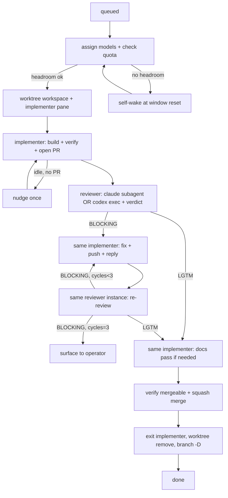

# Lifecycle, concurrency, quota headroom, and self-scheduling

The orchestrator's state machine and the two disciplines that keep it correct: never overspend a subscription, and never busy-poll. Command detail lives in [herdr-cli.md](herdr-cli.md) and [agent-clis.md](agent-clis.md); prompts in [agent-prompts.md](agent-prompts.md).

## Per-issue state machine

Each issue moves through fixed states. Between states you either block on a herdr wait or end your turn on a self-wake — never spin.



- **Reuse both instances.** The implementer pane handles the first build and every fix cycle. The reviewer instance persists too: a claude reviewer subagent is continued with SendMessage; a codex reviewer is resumed with `codex exec resume <session-id>`. Never a fresh instance per cycle — accumulated context is the point.
- **Gate on the verdict, not on finding text.** Read only the `VERDICT:` line and whether unresolved actionable items remain. The PR comment is the implementer↔reviewer handoff; do not relay findings yourself.
- **Fix-cycle cap = 3.** After the 3rd BLOCKING verdict, escalate to the operator and leave both instances alive.

## Concurrency

- At most **2 issues in flight** (2 implementer panes; orchestrator-side reviewers don't count against the cap but do burn quota — factor them into headroom).
- Each issue is its own worktree workspace. When both slots are full, queue the rest.
- Free a slot only after full teardown (merge + worktree/workspace removed + branch deleted). Teardown is part of DONE, not optional hygiene — a merged PR with a live worktree is an unfinished issue.
- **Stale sweep at session boundaries.** At session start and before ending a session, run `herdr worktree list --cwd <repo-root> --json` and tear down any worktree whose PR is merged or closed. Never leave stale worktrees behind.
- Advance one gating step at a time: block on the agent you need next; when that wait returns, take a single `herdr agent list` snapshot to catch the other issue's progress, act, then block again. That is event-driven, not polling.
- A claude reviewer subagent runs in the background — dispatch it, then go service the other issue; its completion notification brings you back.

## Quota headroom — asymmetric gates, always leave room

Both subscriptions are shared with the operator's other work. The gates differ because the plans differ:

| Family | Binding window | Stop dispatching when | Exception |
|---|---|---|---|
| codex | weekly only (no 5h window) | remaining ≤ **15%** | weekly reset ≤ ~12 h away — finishing in-flight work is fine |
| claude | 5h window | remaining ≤ **20%** | 5h reset ≤ ~30 min away |

The reset-imminent exception exists because burning the tail of a window that's about to reset costs the operator nothing; parking work then would just waste wall-clock. Claude's weekly window is a secondary watch: if it becomes the binding constraint, surface that to the operator rather than silently gating on it.

Gate at three points, using `cclimits --json --claude --codex` (shape in [agent-clis.md](agent-clis.md); add `--cached` for repeated checks in one turn):

1. **Before assigning models to an issue.** A gated family → pick the other family for that role (keeping the pairing opposite-family) or, if neither qualifies, queue the issue and self-wake at the soonest relevant reset. If a provider's `status` isn't `ok`, its quota is unmeasured — proceed, tell the operator, and let runtime quota errors be the stop.
2. **Before each fix/re-review dispatch.** Re-check the two families on that issue. If one has crossed its gate, do not send its next turn; park it and self-wake.
3. **When a run fails on a provider quota/rate-limit error.** Treat that family as exhausted, read the real reset from cclimits, and self-wake.

Graceful wind-down of an in-flight implementer: let its current turn finish (`herdr agent wait <target> --until idle`), then leave it parked — do not exit it; you resume it after reset by sending its next prompt. Record which issue/PR is parked, which family, and why. Claude-side note: the orchestrator itself burns the claude subscription — when claude is the tight window, prefer dispatching codex-side work and keep your own turns short.

Report quota as provider + window + % used + reset countdown only; never print account ids or emails.

## Self-scheduling (no busy-wait for long waits)

For short waits (an agent finishing a turn), block on `herdr agent wait`/`agent prompt --wait`. For long waits (a quota window resetting in hours), do **not** hold a blocking call and do **not** poll. Arm a detached self-wake that re-prompts your own orchestrator pane at the reset time, then end your turn:

```bash
# SECS parsed from cclimits resets_in (e.g. "1h 47m" -> 6420); floor at 30.
[ "$SECS" -lt 30 ] && SECS=30
nohup sh -c "sleep $SECS; \
  herdr agent prompt orch 'RESUME: quota window reset — re-run cclimits and resume dispatch for the parked issues.'" \
  >/dev/null 2>&1 &
```

The detached process outlives your turn; when it fires it injects a prompt into your own pane (via the stable `orch` label), which wakes you to re-check quota and resume. After arming it, report what you parked and the wake time, then end the turn. Optionally `herdr notification show "quota wait" --body "resumes in ${SECS}s" --sound done` so the operator knows.

If several windows block different issues, arm one self-wake at the **soonest** relevant reset; on wake, re-evaluate all parked issues.

## Turn checklist

Before ending a turn, confirm:

- every in-flight agent is either being waited on (blocking), running in the background with a completion path back to you, or parked with a self-wake armed;
- no issue is silently stalled;
- the output-contract state (SKILL.md) is reported with secrets redacted;
- nothing is waiting on a busy-poll loop.
