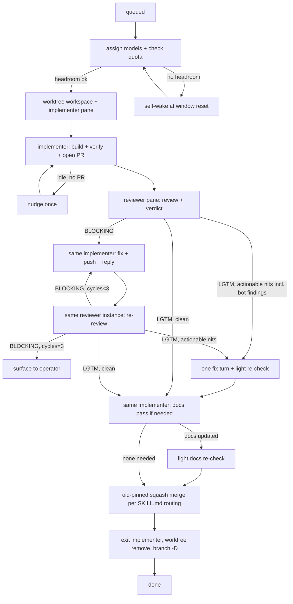

# Lifecycle, concurrency, quota headroom, and self-scheduling

The orchestrator's state machine and the two disciplines that keep it correct: never overspend a subscription, and never busy-poll. Command detail lives in [herdr-cli.md](herdr-cli.md) and [agent-clis.md](agent-clis.md); prompts in [agent-prompts.md](agent-prompts.md).

## Per-issue state machine

Each issue moves through fixed states. Between states you either block on a herdr wait or end your turn on a self-wake — never spin.



- **Reuse both panes.** The implementer pane handles the first build and every fix cycle. The reviewer pane persists too: every re-review is another `herdr agent prompt r<n>` to the same agent. Never a fresh instance per cycle — accumulated context is the point.
- **Third-party bot reviews are part of the loop.** Automated review agents post to the PR shortly after it opens. The reviewer weighs their findings in its verdict; the implementer's fix cycles must resolve every actionable bot finding (including inline threads), not just the reviewer's.
- **Gate on the attested verdict, not on finding text.** Read only the `VERDICT:` line, the `Reviewed commit:` OID it attests, and whether unresolved actionable items remain; the verdict is valid only while the PR head equals that OID (capture a fresh OID before every review dispatch). The PR comment is the implementer↔reviewer handoff; do not relay findings yourself.
- **Fix-cycle cap = 3.** After the 3rd BLOCKING verdict, escalate to the operator and leave both instances alive.

## Concurrency

- At most **2 issues in flight** — up to 4 agent panes (one implementer + one reviewer per issue). Reviewers burn quota like any agent; factor them into headroom.
- Each issue is its own worktree workspace. When both slots are full, queue the rest.
- Free a slot only after full teardown (merge + worktree/workspace removed + branch deleted). Teardown is part of DONE, not optional hygiene — a merged PR with a live worktree is an unfinished issue.
- **Stale sweep at session boundaries.** At session start and before ending a session, run `herdr worktree list --cwd <repo-root> --json` and tear down any worktree whose PR is **merged**. Closed-but-unmerged PRs may be intentionally retained — surface those to the operator instead of deleting. Never leave stale worktrees behind.
- Advance one gating step at a time: block on the agent you need next; when that wait returns, take a single `herdr agent list` snapshot to catch the other issue's progress, act, then block again. That is event-driven, not polling.
- Reviews are pane prompts like everything else: dispatch with `herdr agent prompt r<n> ... --wait`, or dispatch without `--wait`, service the other issue, and come back with `herdr agent wait r<n>`.

## Quota headroom — window-length gates, always leave room

All five subscriptions are shared with the operator's other work. The gate depends on the window's length, not the provider:

| Window length | Providers with such a binding window | Stop dispatching when | Exception |
|---|---|---|---|
| ≤ 5h | claude (5h), opencode-go/deepseek (5h), z.ai/glm (5h credits — Lite 2,000) | remaining ≤ **20%** | reset ≤ ~30 min away |
| weekly/monthly | codex (weekly only — no 5h), grok (Supergrok shared weekly pool), z.ai/glm (weekly credits — Lite 10,000) | remaining ≤ **15%** | reset ≤ ~12 h away — finishing in-flight work is fine |

The reset-imminent exception exists because burning the tail of a window that's about to reset costs the operator nothing; parking work then would just waste wall-clock. Longer secondary windows (claude weekly, opencode-go weekly/monthly) are a secondary watch: if one becomes the binding constraint, surface that to the operator rather than silently gating on it.

**Allowance-aware routing:** OpenCode Go currently gives DeepSeek Flash a $60 monthly model allowance plus a temporary 2×-usage benefit; Pro gets $15. Prefer Flash for routine bulk work and verify the live catalog before relying on the promotion. Grok's shared weekly pool burns much faster: if its recent pace would exhaust the pool before reset, reserve it even above the 15% floor. CodexBar may omit Grok's `windowMinutes`; classify that result as weekly.

**Parked z.ai lane:** Lite provides 2,000 credits/5h and 10,000/week, with half-rate usage outside 14:00–18:00 UTC+8 weekdays. Do not dispatch it while GLM-5.2/5.1 auto-route to the unstable GLM-5.3 endpoint.

Gate at three points, using `codexbar usage --json --provider <p>` for the family you're about to spend (shape, latencies, and the cclimits fallback in [agent-clis.md](agent-clis.md); codexbar has no cache — reuse this turn's results for repeated checks):

1. **Before assigning models to an issue.** A gated family → pick another family for that role (keeping the pairing cross-family) or, if none qualifies, queue the issue and self-wake at the soonest relevant reset. If codexbar returns an `error` element for a provider (or, under the cclimits fallback, the provider isn't covered or `status` isn't `ok`), its quota is unmeasured — proceed, tell the operator, and let runtime quota errors be the stop.
2. **Before every subsequent dispatch on an issue** — review, fix, re-review, and docs turns alike. Re-check the family you are about to spend. If it has crossed its gate, do not send that turn; park it and self-wake.
3. **When a run fails on a provider quota/rate-limit error.** Treat that family as exhausted, read the real reset from codexbar, and self-wake.

Graceful wind-down of an in-flight implementer: let its current turn finish (`herdr agent wait <target> --timeout <ms>`), then leave it parked — do not exit it; you resume it after reset by sending its next prompt. Record which issue/PR is parked, which family, and why. Claude-side note: the orchestrator itself burns the claude subscription — when claude is the tight window, prefer dispatching codex-side work and keep your own turns short.

Report quota as provider + window + % used + reset countdown only; never print account ids or emails.

## Self-scheduling (no busy-wait for long waits)

For short waits (an agent finishing a turn), block on `herdr agent wait`/`agent prompt --wait`. For long waits (a quota window resetting in hours), do **not** hold a blocking call and do **not** poll. Arm a detached self-wake that re-prompts your own orchestrator pane at the reset time, then end your turn:

```bash
# SECS = codexbar resetsAt (ISO-8601) minus now; with the cclimits fallback,
# parse its humanized resets_in (e.g. "1h 47m" -> 6420). Floor at 30.
[ "$SECS" -lt 30 ] && SECS=30
nohup sh -c "sleep $SECS; \
  herdr agent prompt orch 'RESUME: quota window reset — re-run the codexbar quota gate and resume dispatch for the parked issues.'" \
  >/dev/null 2>&1 &
```

The detached process outlives your turn; when it fires it injects a prompt into your own pane (via the stable `orch` label), which wakes you to re-check quota and resume. After arming it, report what you parked and the wake time, then end the turn. Optionally `herdr notification show "quota wait" --body "resumes in ${SECS}s" --sound done` so the operator knows.

If several windows block different issues, arm one self-wake at the **soonest** relevant reset; on wake, re-evaluate all parked issues.

## Turn checklist

Before ending a turn, confirm:

- every in-flight agent is either being waited on (blocking), running in the background with a completion path back to you, or parked with a self-wake armed;
- no issue is silently stalled;
- the output-contract state (SKILL.md) is reported with secrets redacted;
- nothing is waiting on a busy-poll loop.
